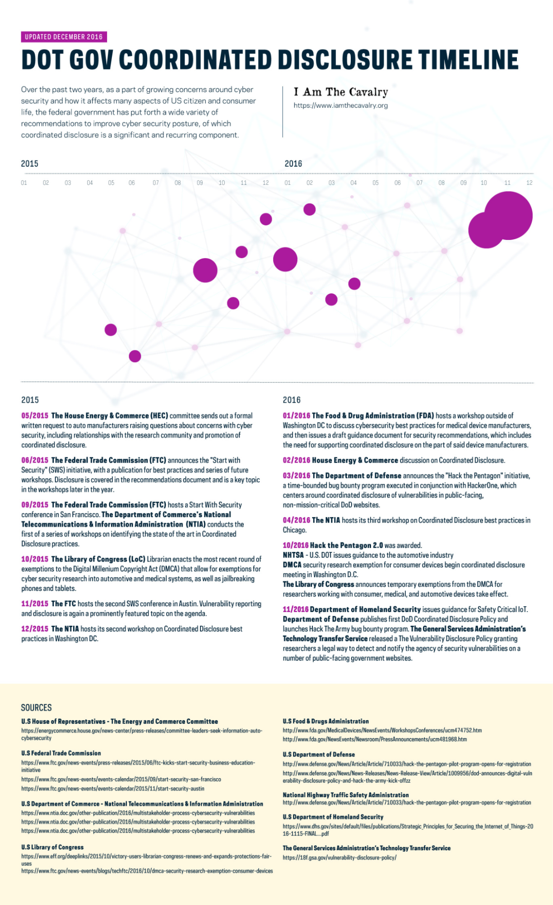

## Background

> Over the past two years, as a part of growing concerns around cyber security and how it affects many aspects of US citizen and consumer life, the federal government has put forth a wide variety of recommendations to improve cyber security posture, of which coordinated disclosure is a significant and recurring component.

*Infographic updated December 2016, produced by [I Am The Cavalry](https://www.iamthecavalry.org) ([archive.ph](https://archive.ph/newest/https://www.iamthecavalry.org)).*

---

## 2015

### 05/2015 — House Energy & Commerce letter to auto manufacturers

The **House Energy & Commerce (HEC)** committee sends out a formal written request to auto manufacturers raising questions about concerns with cyber security, including relationships with the research community and promotion of coordinated disclosure.

**Known contributors:**
- **Fred Upton** (R-MI) — Committee Chairman who spearheaded the letter. *[The Hill](https://thehill.com/policy/cybersecurity/249175-rising-fear-of-car-hackers-sparks-action-in-washington/): "Upton and Pallone spearheaded a letter sent to 17 automakers pressing for details on their cybersecurity plans."*
- **Frank Pallone Jr.** (D-NJ) — Ranking Member who co-signed. *(same source)*
- **Michael Burgess** (R-TX) — Chair, Subcommittee on Commerce, Manufacturing, and Trade (medium confidence; named as involved per [Autoblog](https://www.autoblog.com/2015/05/29/car-hacking-threats-congressional-scrutiny/)).
- **Jan Schakowsky** (D-IL) — CMT Subcommittee Ranking Member (medium confidence; same source).

**Quiet giants:** The majority and minority staff counsel on the CMT subcommittee drafted the technical questions — particularly on over-the-air updates, third-party researcher handling, and cryptographic integrity — but House rules treat committee products as signed-out-by-Members, staff-drafted. Their names are not public.

### 06/2015 — FTC "Start with Security" initiative launched

The **Federal Trade Commission (FTC)** announces the "Start with Security" (SwS) initiative, with a publication for best practices and series of future workshops. Disclosure is covered in the recommendations document and is a key topic in the workshops later in the year.

**Known contributors:**
- **Edith Ramirez** — FTC Chairwoman who launched the initiative. *[IAPP](https://iapp.org/news/a/ftc-announces-start-with-security-agenda/): "Chairwoman Edith Ramirez will deliver remarks at the event."*
- **Jessica Rich** — Director, FTC Bureau of Consumer Protection; her bureau built and ran Start with Security. *[Brookings Q&A](https://www.brookings.edu/articles/three-questions-with-jessica-rich-director-of-the-ftcs-bureau-of-consumer-protection/): "Jessica Rich, Director of the FTC's Bureau of Consumer Protection … promoting good data security practices has long been a priority for the FTC."*
- **Ashkan Soltani** — FTC Chief Technologist; SwS program participant.

**Quiet giants:** The BCP staff who drafted the 10-step "Start with Security" business guide, and the Division of Privacy and Identity Protection (DPIP) staff attorneys who moderated the workshops, are the actual drafters of record and remain unnamed in public materials.

### 09/2015 — FTC SwS San Francisco + first NTIA multistakeholder workshop

The **FTC** hosts a Start With Security conference in San Francisco. **The Department of Commerce's National Telecommunications & Information Administration (NTIA)** conducts the first of a series of workshops on identifying the state of the art in Coordinated Disclosure practices.

**Known contributors (NTIA):**
- **Allan Friedman** — Director of Cybersecurity Initiatives at NTIA; day-to-day convener of the multistakeholder process. *[NTIA meeting document](https://www.ntia.gov/files/ntia/iti_05272015.pdf) lists him as the NTIA contact.*
- **Angela Simpson** — Deputy Assistant Secretary of Commerce for Communications and Information; announced and publicly championed the process. *[NTIA publications](https://www.ntia.gov/other-publication/multistakeholder-process-cybersecurity-vulnerabilities) reference her launch blog.*
- **Katie Moussouris** (Luta Security; co-editor of ISO/IEC 29147 & 30111) — named Awareness and Adoption Working Group participant. *[2016 NTIA A&A Insights Report](https://www.ntia.gov/files/ntia/publications/2016_ntia_a_a_vulnerability_disclosure_insights_report.pdf): "Katie Moussouris (co-editor of ISO 29147 & ISO 30111)".*
- **Art Manion** (CERT/CC) — CERT Coordination Center participant (medium confidence; organizational membership confirmed, individual WG role inferred).

**Quiet giants (NTIA):** The four NTIA Working Group outputs were drafted largely by volunteer researchers, vendor product-security leads, and civil-society lawyers — not by NTIA staff. Working-group co-chairs and drafting editors are listed in the published PDFs but not credited in any NTIA press release. A follow-up PDF-extraction pass is needed to pull the full Safety WG / Multi-party / Awareness and Adoption / Disclosure Template rosters.

### 10/2015 — Library of Congress DMCA §1201 security research exemption

The **Library of Congress (LoC)** Librarian enacts the most recent round of exemptions to the Digital Millennium Copyright Act (DMCA) that allow for exemptions for cyber security research into automotive and medical systems, as well as jailbreaking phones and tablets. This is one of the most consequential moments in U.S. security-research legal history.

**Known contributors — petitioners (the academic record):**
- **Steven M. Bellovin** (Columbia) · **Matt Blaze** (Penn) · **Edward W. Felten** (Princeton) · **J. Alex Halderman** (Michigan) · **Nadia Heninger** (Penn). *[EFF petition filing](https://www.eff.org/document/bellovin-blaze-felten-halderman-and-heninger-security-research-exemption-request): "Bellovin, Blaze, Felten, Halderman, and Heninger Security Research Exemption Request".*

**Known contributors — counsel:**
- **Andrea M. Matwyshyn** (then Northeastern Law / Center for Law, Innovation, and Creativity) — counsel of record for the academic petitioners before the Copyright Office. *[Wikipedia](https://en.wikipedia.org/wiki/Andrea_M._Matwyshyn): "represented computer scientists Steve Bellovin, Matt Blaze, Alex Halderman, and Nadia Heninger and testified before the Copyright Office in a successful petition".*
- **Kit Walsh** — EFF Staff Attorney; testified May 19, 2015 on Proposed Class 22 (vehicle software security/safety research). *[EFF announcement](https://www.eff.org/deeplinks/2015/05/eff-testifies-exemptions-dmca-section-1201).*
- **Mitch Stoltz** — EFF Staff Attorney; testified May 20–21 on abandoned software / jailbreaking classes. *(same source)*
- **Corynne McSherry** — EFF Legal Director. *(same source)*

**Known contributors — issuing officials:**
- **Maria A. Pallante** — Register of Copyrights who issued the Sixth Triennial Register's Recommendation. *[Copyright Office 2015 letter](https://copyright.gov/1201/2015/2015_NTIA_Letter.pdf) identifies her as Register.*
- **James H. Billington** — Librarian of Congress who issued the final rule adopting the exemption (October 2015).

**Quiet giants:** The career attorneys inside the U.S. Copyright Office who wrote the actual Register's Recommendation — hundreds of pages of legal analysis — are named inside the recommendation PDF but essentially invisible in the public retelling. Rapid7 researchers who testified alongside the academics are also underdocumented here.

### 11/2015 — FTC SwS Austin

The **FTC** hosts the second SWS conference in Austin. Vulnerability reporting and disclosure is again a prominently featured topic on the agenda.

*Contributors as 06/2015 + 09/2015 FTC roster.*

### 12/2015 — NTIA second workshop (Washington DC)

The **NTIA** hosts its second workshop on Coordinated Disclosure best practices in Washington DC.

*Contributors as 09/2015 NTIA roster.*

---

## 2016

### 01/2016 — FDA medical-device cybersecurity workshop + draft postmarket guidance

The **Food & Drug Administration (FDA)** hosts a workshop outside of Washington DC to discuss cybersecurity best practices for medical device manufacturers, and then issues a draft guidance document for security recommendations, which includes the need for supporting coordinated disclosure on the part of said device manufacturers.

**Known contributors:**
- **Suzanne B. Schwartz, MD, MBA** — Associate Director for Science & Strategic Partnerships at FDA's Center for Devices and Radiological Health (CDRH); chairs CDRH's Cybersecurity Working Group. *[USENIX Security '18 bio](https://www.usenix.org/conference/usenixsecurity18/presentation/schwartz): "Suzanne B. Schwartz, MD, MBA is the Associate Director for Science & Strategic Partnerships at FDA's Center for Devices & Radiological Health (CDRH). She chairs CDRH's Cybersecurity Working Group".*
- **Seth Carmody** — Cybersecurity Program Manager, CDRH; co-chair of CDRH's Cybersecurity Working Group. *[AAMI peer-reviewed article](https://array.aami.org/doi/full/10.2345/0899-8205-52.2.103): "Seth Carmody is a Cybersecurity Program Manager at CDRH".*

**Quiet giants:** CDRH Cybersecurity Working Group had additional members — FDA OGC attorneys, postmarket surveillance staff — who drafted guidance language but are not publicly named. MITRE FFRDC personnel supporting the initiative are also uncredited.

### 02/2016 — House E&C discussion on Coordinated Disclosure

*Contributors as 05/2015 HEC roster.*

### 03/2016 — DoD "Hack the Pentagon" pilot

The **Department of Defense** announces the "Hack the Pentagon" initiative, a time-bounded bug bounty program executed in conjunction with HackerOne, which centers around coordinated disclosure of vulnerabilities in public-facing, non-mission-critical DoD websites.

**Known contributors (DoD):**
- **Ash Carter** — Secretary of Defense; announced the program and signed the DoD VDP in November. *[USDS Medium post by Wiswell](https://medium.com/the-u-s-digital-service/hacking-the-pentagon-69486aa9f226) frames Carter as committing sponsor.*
- **Chris Lynch** — founding Director of the Defense Digital Service (DDS), the unit that ran Hack the Pentagon. *[Gov Exec on Lynch's departure](https://www.govexec.com/technology/2019/04/pentagons-digital-guru-chris-lynch-depart/156478/).*
- **Lisa Wiswell** — "Bureaucracy Hacker" at DDS; the operational champion who made it happen. *[USDS Medium post](https://medium.com/the-u-s-digital-service/hacking-the-pentagon-69486aa9f226) is by-lined "By Lisa Wiswell, Bureaucracy Hacker at [the Defense Digital Service]".*

**Known contributors (HackerOne, private-sector partner):**
- **Mårten Mickos** — HackerOne CEO. *[HackerOne Hack the Pentagon page](https://www.hackerone.com/events/hack-the-pentagon) quotes: "Marten Mickos, CEO at HackerOne … 'Powered by the Defense Digital Service, the DoD has established the most iterative and effective approach to cybersecurity in the modern era.'"*
- **Alex Rice** — HackerOne co-founder and CTO.

**Quiet giants:** The civil-service lawyers inside DoD Office of General Counsel (and the DC3 VDP team stood up to operate the program after the pilot) actually wrote the safe-harbor language in the DoD VDP. Wiswell is rightly the public champion, but the DC3 operations staff and OGC attorneys who made the policy legally durable are not named.

### 04/2016 — NTIA third multistakeholder workshop (Chicago)

*Contributors as 09/2015 NTIA roster.*

### 10/2016 — Hack the Pentagon 2.0, NHTSA guidance, DMCA exemption takes effect

- **Hack the Pentagon 2.0** — DDS + HackerOne roster as 03/2016.
- **NHTSA "Cybersecurity Best Practices for Modern Vehicles"** (DOT HS 812 333, October 2016) — authored institutionally as "Washington, DC: Author" (NHTSA convention). **Dr. Mark R. Rosekind** was NHTSA Administrator at the original release. The OVSR (Office of Vehicle Safety Research) staff who actually drafted the guideline are not publicly identified — a deliberate anonymizing convention in NHTSA technical reports.
- **DMCA** security research exemption for consumer devices coordinated disclosure meeting in Washington D.C. *(LoC/EFF/academic roster as 10/2015.)*
- **Library of Congress** temporary exemptions from the DMCA for consumer/medical/automotive device researchers take effect. *(Pallante + Billington.)*

### 11/2016 — DHS IoT principles, DoD VDP + Hack the Army, 18F/GSA VDP

- **DHS "Strategic Principles for Securing the Internet of Things" v1.0** — authored institutionally as "U.S. Department of Homeland Security." **Robert Silvers**, then Assistant Secretary for Cyber Policy, was the senior official publicly associated with the release. The DHS NPPD (now CISA), Office of Policy, and S&T interagency drafters are not individually named.
- **DoD first Coordinated Disclosure Policy + Hack the Army launch** — Carter/Lynch/Wiswell/DDS roster as 03/2016.
- **18F / GSA Technology Transformation Service VDP** — drafted by 18F with **Eric Mill** (Software Engineer, 18F/GSA) as the publicly-documented champion. *[Mill's résumé](https://konklone.com/resume): "Over multiple roles at GSA and 18F, introduced vulnerability disclosure policies and bug bounties to the civilian government."* Other 18F drafters are retrievable from the [18F/vulnerability-disclosure-policy](https://github.com/18F/vulnerability-disclosure-policy) git commit history — a follow-up to pull those individual contributor names is pending.

---

## Sources

*Each source has both an `archive.ph/newest/` permalink (resolves to the most recent archive.ph snapshot, or offers to create one) and a confirmed Wayback Machine snapshot where one exists. Several 2015-era FDA URLs are now dead at the origin but well-preserved on the Wayback Machine.*

### U.S. House of Representatives — The Energy and Commerce Committee
- [committee-leaders-seek-information-auto-cybersecurity](https://energycommerce.house.gov/news-center/press-releases/committee-leaders-seek-information-auto-cybersecurity) · [archive.ph](https://archive.ph/newest/https://energycommerce.house.gov/news-center/press-releases/committee-leaders-seek-information-auto-cybersecurity) · [archive.org (2017-05-19)](http://web.archive.org/web/20170519182209/https://energycommerce.house.gov/news-center/press-releases/committee-leaders-seek-information-auto-cybersecurity)

### U.S. Federal Trade Commission
- [FTC kicks Start with Security business education initiative (2015/06)](https://www.ftc.gov/news-events/press-releases/2015/06/ftc-kicks-start-security-business-education-initiative) · [archive.ph](https://archive.ph/newest/https://www.ftc.gov/news-events/press-releases/2015/06/ftc-kicks-start-security-business-education-initiative) · [archive.org (2015-09-05)](http://web.archive.org/web/20150905155819/https://www.ftc.gov/news-events/press-releases/2015/06/ftc-kicks-start-security-business-education-initiative)
- [Start with Security — San Francisco (2015/09)](https://www.ftc.gov/news-events/events-calendar/2015/09/start-security-san-francisco) · [archive.ph](https://archive.ph/newest/https://www.ftc.gov/news-events/events-calendar/2015/09/start-security-san-francisco) · [archive.org (2015-09-05)](http://web.archive.org/web/20150905111910/https://www.ftc.gov/news-events/events-calendar/2015/09/start-security-san-francisco)
- [Start with Security — Austin (2015/11)](https://www.ftc.gov/news-events/events-calendar/2015/11/start-security-austin) · [archive.ph](https://archive.ph/newest/https://www.ftc.gov/news-events/events-calendar/2015/11/start-security-austin) · [archive.org (2015-09-05)](http://web.archive.org/web/20150905160314/https://www.ftc.gov/news-events/events-calendar/2015/11/start-security-austin)

### U.S. Department of Commerce — NTIA
- [Multistakeholder Process: Cybersecurity Vulnerabilities (2016)](https://www.ntia.doc.gov/other-publication/2016/multistakeholder-process-cybersecurity-vulnerabilities) · [archive.ph](https://archive.ph/newest/https://www.ntia.doc.gov/other-publication/2016/multistakeholder-process-cybersecurity-vulnerabilities) · [archive.org (2016-04-08)](http://web.archive.org/web/20160408100534/http://www.ntia.doc.gov/other-publication/2016/multistakeholder-process-cybersecurity-vulnerabilities)

### U.S. Library of Congress
- [EFF: Victory — Librarian of Congress Renews and Expands Protections, Fair Uses (2015/10)](https://www.eff.org/deeplinks/2015/10/victory-users-librarian-congress-renews-and-expands-protections-fair-uses) · [archive.ph](https://archive.ph/newest/https://www.eff.org/deeplinks/2015/10/victory-users-librarian-congress-renews-and-expands-protections-fair-uses) · [archive.org (2015-10-28)](http://web.archive.org/web/20151028125224/https://www.eff.org/deeplinks/2015/10/victory-users-librarian-congress-renews-and-expands-protections-fair-uses)
- [FTC TechFTC: DMCA security research exemption for consumer devices (2016/10)](https://www.ftc.gov/news-events/blogs/techftc/2016/10/dmca-security-research-exemption-consumer-devices) · [archive.ph](https://archive.ph/newest/https://www.ftc.gov/news-events/blogs/techftc/2016/10/dmca-security-research-exemption-consumer-devices) · [archive.org (2022-03-01)](http://web.archive.org/web/20220301170744/https://www.ftc.gov/news-events/blogs/techftc/2016/10/dmca-security-research-exemption-consumer-devices)

### U.S. Food & Drug Administration
> Note: the FDA `ucm*` URL paths were retired when the FDA restructured its website. The originals below no longer resolve; the Wayback snapshots are the canonical archive.

- **Dead at origin** — [MedicalDevices / Workshops & Conferences — ucm474752.htm](http://www.fda.gov/MedicalDevices/NewsEvents/WorkshopsConferences/ucm474752.htm) · [archive.ph](https://archive.ph/newest/http://www.fda.gov/MedicalDevices/NewsEvents/WorkshopsConferences/ucm474752.htm) · [archive.org (2015-12-05)](http://web.archive.org/web/20151205213535/http://www.fda.gov/MedicalDevices/NewsEvents/WorkshopsConferences/ucm474752.htm)
- **Dead at origin** — [Newsroom / Press Announcements — ucm481968.htm](http://www.fda.gov/NewsEvents/Newsroom/PressAnnouncements/ucm481968.htm) · [archive.ph](https://archive.ph/newest/http://www.fda.gov/NewsEvents/Newsroom/PressAnnouncements/ucm481968.htm) · [archive.org (2016-01-17)](http://web.archive.org/web/20160117165637/http://www.fda.gov/NewsEvents/Newsroom/PressAnnouncements/ucm481968.htm)

### U.S. Department of Defense
- [Hack the Pentagon pilot program opens for registration — Article 710033](http://www.defense.gov/News/Article/Article/710033/hack-the-pentagon-pilot-program-opens-for-registration) · [archive.ph](https://archive.ph/newest/http://www.defense.gov/News/Article/Article/710033/hack-the-pentagon-pilot-program-opens-for-registration) · [archive.org (2016-12-14)](http://web.archive.org/web/20161214154144/http://www.defense.gov/News/Article/Article/710033/hack-the-pentagon-pilot-program-opens-for-registration)
- [DoD announces digital vulnerability disclosure policy and Hack the Army kick-off — Article 1009956](http://www.defense.gov/News/News-Releases/News-Release-View/Article/1009956/dod-announces-digital-vulnerability-disclosure-policy-and-hack-the-army-kick-off) · [archive.ph](https://archive.ph/newest/http://www.defense.gov/News/News-Releases/News-Release-View/Article/1009956/dod-announces-digital-vulnerability-disclosure-policy-and-hack-the-army-kick-off) · [archive.org (2016-11-22)](http://web.archive.org/web/20161122080236/http://www.defense.gov/News/News-Releases/News-Release-View/Article/1009956/dod-announces-digital-vulnerability-disclosure-policy-and-hack-the-army-kick-off)

> **Fact-check finding — typo on the infographic:** the Article 1009956 URL as printed on the infographic ends in `…-kick-offzz` (trailing `zz`). The correct URL ends `…-kick-off`. The corrected URL is what's linked above and what the Wayback Machine has a snapshot of.

### National Highway Traffic Safety Administration
> **Fact-check finding — copy-paste error on the infographic:** the NHTSA source block prints the same URL as the DoD Article 710033 entry. The intended NHTSA reference is *Cybersecurity Best Practices for Modern Vehicles* (DOT HS 812 333, October 2016) — institutionally authored by NHTSA with no individual drafters named on the cover. Tracking down a canonical deep-link to the DOT HS 812 333 PDF is a follow-up task.

- [as-printed on infographic — appears to be a copy-paste of the DoD URL](http://www.defense.gov/News/Article/Article/710033/hack-the-pentagon-pilot-program-opens-for-registration) · [archive.ph](https://archive.ph/newest/http://www.defense.gov/News/Article/Article/710033/hack-the-pentagon-pilot-program-opens-for-registration) · [archive.org (2016-12-14)](http://web.archive.org/web/20161214154144/http://www.defense.gov/News/Article/Article/710033/hack-the-pentagon-pilot-program-opens-for-registration)

### U.S. Department of Homeland Security
- [Strategic Principles for Securing the Internet of Things (2016-11-15, PDF)](https://www.dhs.gov/sites/default/files/publications/Strategic_Principles_for_Securing_the_Internet_of_Things-2016-1115-FINAL....pdf) · [archive.ph](https://archive.ph/newest/https://www.dhs.gov/sites/default/files/publications/Strategic_Principles_for_Securing_the_Internet_of_Things-2016-1115-FINAL....pdf) · [archive.org PDF (2016-11-25)](http://web.archive.org/web/20161125205351/https://www.dhs.gov/sites/default/files/publications/Strategic_Principles_for_Securing_the_Internet_of_Things-2016-1115-FINAL....pdf)

### The General Services Administration's Technology Transfer Service
- [18F Vulnerability Disclosure Policy](https://18f.gsa.gov/vulnerability-disclosure-policy/) · [archive.ph](https://archive.ph/newest/https://18f.gsa.gov/vulnerability-disclosure-policy/) · [archive.org (2016-11-14)](http://web.archive.org/web/20161114231116/https://18f.gsa.gov/vulnerability-disclosure-policy/)

### Infographic attribution
- [I Am The Cavalry](https://www.iamthecavalry.org) · [archive.ph](https://archive.ph/newest/https://www.iamthecavalry.org) · [archive.org (earliest snapshot 2013-10-15)](http://web.archive.org/web/20131015010522/http://iamthecavalry.org/)

---

## Enrichment status

This page has been through a **first people-enrichment pass** (2026-04-24): inline "Known contributors" blocks added to each entry from public-record sources, with citations and quoted evidence. Research gaps flagged as **"quiet giants"** per entry.

**Outstanding follow-ups:**
- NTIA working-group co-chair rosters (inside the Safety / Multi-party / Awareness & Adoption / Early-Stage Template PDFs — need direct PDF extraction).
- U.S. Copyright Office career attorneys who drafted the 2015 Register's Recommendation for DMCA §1201 (named inside the recommendation PDF but invisible in public retellings).
- 18F/GSA VDP co-authors from git commit history on [18F/vulnerability-disclosure-policy](https://github.com/18F/vulnerability-disclosure-policy).
- DC3 operations staff and DoD OGC attorneys who drafted the durable DoD VDP safe-harbor language.
- Rapid7 researchers who testified on the DMCA §1201 exemption alongside the academics.

If you worked on any of this or remember who did, contributions are welcome at [github.com/disclose/vuln-disclosure-history](https://github.com/disclose/vuln-disclosure-history).
